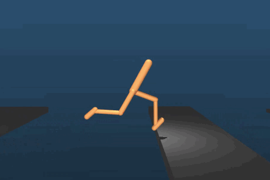

# About
This repository contains the Unity environment used for a short lecture I gave about Reinforcement-Learning in Unity Environments in class during a Game Development course.  

The environment contains some simple examples of teaching an Agent to touch a goal using simple movement controls on a flat plane.  

  
!! The GIF above is just for illustration, it's not what the code in my repository does.
